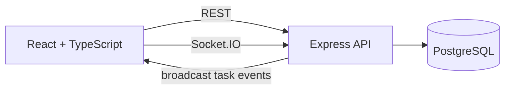

## Real-Time Task Board

A collaborative task board where multiple users can create, update, and delete tasks in real time. The app uses a React frontend, an Express API, PostgreSQL for persistence, and Socket.IO for live updates across connected clients.

## Quick Start

### Option 1: one-command local dev

#### Prerequisites

- Node 22
- PostgreSQL 16
- A running local PostgreSQL server

#### Run the application

1. Install dependencies: `npm install`
2. Copy environment variables: `cp .env.example .env`
3. If your local PostgreSQL auth does not use `postgres:postgres`, update `DATABASE_URL` in `.env`
   - On macOS/Homebrew, the working default is often: `postgres://$(whoami)@localhost:5432/auxilius_take_home`
4. Start PostgreSQL if needed
   - Example (Homebrew): `brew services start postgresql@16`
5. Create the local database: `createdb auxilius_take_home`
6. Export the environment variables into your shell: `set -a; . ./.env; set +a`
7. Initialize the schema: `psql "$DATABASE_URL" -f api/db/init.sql`
8. Start the API and frontend together: `npm run dev`
9. Open the frontend in your browser at `http://localhost:5173`
10. Enter a username on first visit to begin using the board

### Option 2: Docker Compose

#### Prerequisites

- Docker Desktop / Docker Engine with Compose support
- On Apple Silicon Macs, the Apple Silicon Docker Desktop build

#### Run the application

1. Copy environment variables: `cp .env.example .env`
2. Make sure ports `3000`, `5173`, and `5432` are not already in use by a local dev server or another Postgres instance
3. Start the full stack: `docker compose up --build -d`
4. Open the frontend in your browser at `http://localhost:5173`
5. Enter a username on first visit to begin using the board
6. When finished, stop the stack with: `docker compose down`

### Troubleshooting

- **`address already in use` on port `3000`, `5173`, or `5432`:** stop the local dev server or other service currently using that port, then rerun the command
- **Local Postgres connection/auth errors:** update `DATABASE_URL` in `.env` to match your local PostgreSQL user/password setup
- **Apple Silicon Docker issue:** if Docker Desktop reports that the Intel build is installed, replace it with the Apple Silicon build before using the Docker path

### Manual smoke pass

1. Open the app in two browser tabs or windows
2. Log in with any username in both tabs
3. Create a task in one tab and confirm it appears in the other
4. Edit the title, description, and status and confirm the other tab updates
5. Delete the task and confirm it disappears in both tabs without refreshing

## Features Implemented

- Username-only login stored in browser `localStorage`
- Create tasks with title, optional description, and status
- Update task details and status
- Delete tasks
- Three-column board layout: To Do, In Progress, Done
- Real-time updates across connected browser tabs/windows
- Basic visual feedback when tasks change
- Shared TypeScript contracts between frontend and backend
- Unit test coverage for frontend and backend logic
- `tsc`, ESLint, and Prettier included in the development workflow

## Tech Stack

### Frontend

- **React + TypeScript** for fast iteration, strong component composition, and good TypeScript support
- **Vite** for simple setup and fast local development
- **Socket.IO client** to receive real-time task updates from the server
- **`ts-query`** as a lightweight frontend query/cache layer for fetching, mutation state, and cache updates

### Backend

- **Express + TypeScript** for a lightweight API server and single-language stack
- **Socket.IO** to broadcast task changes after successful writes
- **Zod** for runtime validation of API request payloads

### Database / Tooling / Infra

- **PostgreSQL** as the source of truth for task data
- **Vitest** for unit tests in frontend and backend code
- **ESLint** for code quality and consistency
- **Prettier** for consistent formatting
- **TypeScript compiler (`tsc --noEmit`)** as a type-safety gate
- **Docker Compose** to run the frontend, backend, and database together

## Architecture Overview

- The **React frontend** renders the task board UI, performs CRUD operations through the REST API, and subscribes to live updates through Socket.IO.
- The **Express backend** exposes the required task endpoints, validates input, persists changes to PostgreSQL, and broadcasts task events after successful database writes.
- **PostgreSQL** is the single source of truth for task data.
- The **`types/` folder** contains shared TypeScript contracts used by both the frontend and backend for API payloads and real-time event shapes.
- The frontend uses a small query/cache layer for UI data management; the backend intentionally does **not** add a cache because consistency and simplicity matter more than read optimization for this scope.
- Real-time behavior uses **REST for writes** and **Socket.IO for fanout** so persistence logic stays centralized.

### Architecture Diagram

### Real-Time Update Flow

1. A user creates, edits, or deletes a task from the frontend
2. The frontend sends a REST request to the API
3. The API validates the request and writes the change to PostgreSQL
4. After the write succeeds, the server emits a Socket.IO event
5. All connected clients update their UI immediately

This design prioritizes correctness and simplicity over more advanced collaboration behavior such as conflict resolution or optimistic concurrency.

## Project Structure

- `web/` — React frontend
- `api/` — Express backend
- `types/` — shared TypeScript contracts for API and socket payloads
- `api/db/` — SQL schema / initialization scripts
- `docker-compose.yml` — local infrastructure
- `.env.example` — required environment variables

## API Endpoints

- `GET /tasks`
- `POST /tasks`
- `PATCH /tasks/:id`
- `DELETE /tasks/:id`

These endpoints handle task CRUD, while Socket.IO notifies connected clients about changes.

## Database Schema

### `tasks`

- `id` — UUID primary key
- `title` — required text
- `description` — nullable text
- `status` — required task status (`todo`, `in_progress`, `done`)
- `created_by` — username of the creator
- `created_at` — creation timestamp
- `updated_at` — last update timestamp

### Schema Design Choices

- A single `tasks` table keeps the data model small and easy to reason about
- `status` is constrained to the three board states required by the assignment
- Timestamps make task updates easier to inspect and debug
- `created_by` preserves lightweight authorship without introducing a full users table

### Indexes / Optimizations

- Primary key index on `id`
- No additional indexes were added initially because the expected dataset is small and the main read pattern is loading the board as a whole

## Authentication Approach

- On first visit, the user chooses a username
- The username is stored in `localStorage`
- The frontend reuses that username for future visits
- The backend treats the provided username as demo identity

This is not production-grade authentication and is a deliberate trade-off to keep the implementation focused on the core requirements.

## Shared Types Strategy

A small shared `types/` folder is used to keep frontend and backend request, response, and socket event contracts aligned. This is intentionally limited to **contracts**, not shared business logic. Runtime validation remains on the backend so compile-time types do not replace API boundary protection.

## Testing and Code Quality

- Type-checking with `tsc --noEmit`
- Linting with ESLint
- Formatting with Prettier
- Unit tests for frontend and backend logic
- Small, reviewable commits intended to keep each change understandable in isolation

## Approximate Time Log

- Project setup, TypeScript, ESLint, Prettier, test scaffolding — 0.5h
- Docker Compose and PostgreSQL schema setup — 0.4h
- Backend API, validation, and persistence — 0.6h
- Real-time Socket.IO integration — 0.5h
- Frontend auth flow and task board UI — 0.7h
- Tests, cleanup, and documentation — 0.3h

## Key Technical Decisions and Trade-Offs

- **React + Express + TypeScript:** a single-language stack keeps the project easier to build, reason about, and review
- **REST for writes, Socket.IO for updates:** avoids splitting business logic across two transport layers
- **PostgreSQL as the source of truth:** no backend cache because the dataset is small and real-time consistency matters more
- **Lightweight demo authentication:** username-only login backed by `localStorage` because secure authentication is out of scope
- **Shared TypeScript contracts:** reduce contract drift between client and server while keeping runtime validation on the backend
- **Frontend query cache:** simplifies fetch and mutation state handling without introducing backend invalidation complexity
- **Minimal schema:** keeps focus on working collaboration behavior rather than overengineering

## Known Limitations

- No password-based or secure authentication
- No user presence indicators
- No edit conflict detection
- No drag-and-drop interactions
- No advanced filtering or search
- Real-time sync assumes last-write-wins behavior
- Styling is intentionally functional rather than polished
- Test coverage is focused on core logic and touched UI paths rather than full end-to-end coverage

## What I Would Improve With More Time

- Add end-to-end tests covering real-time behavior across multiple browser sessions
- Improve accessibility and keyboard interactions
- Add optimistic UI updates with reconciliation
- Add user presence and “last edited by” indicators
- Improve error states and retry behavior
- Add drag-and-drop task movement
- Harden the Docker/dev experience for production-like deployment
- Expand API contract sharing where it adds value while keeping runtime validation authoritative

## Notes for Reviewers

- The project can be run either with local PostgreSQL + `npm run dev` or with Docker Compose
- The implementation intentionally prioritizes working real-time collaboration, clear boundaries, and maintainable code over advanced features
- Commit history is intentionally kept small and reviewable to show the construction of the application in discrete steps
